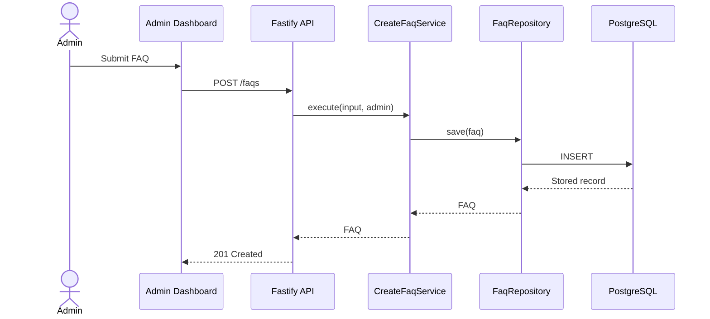

# Full-Stack Architecture Example

> **Non-normative example:** This document demonstrates one possible architecture for a small FAQ platform. The technologies, directory structure, authentication model, hosting providers, and architectural patterns are illustrative only. Do not adopt them unless they are supported by the inspected repository, project constraints, requirements, or an approved architectural decision.

## 1. Purpose

This document describes the architecture of an example FAQ platform containing:

- a public website;
- an administration dashboard;
- an HTTP API;
- persistent storage;
- authentication for administrators;
- deployment infrastructure.

## 2. System Context

The platform has two user groups:

1. Public visitors browse and search published FAQs.
2. Administrators manage FAQ content through a protected dashboard.

```text
Public visitor → Public web application ─┐
                                         ├→ Fastify API → PostgreSQL
Administrator → Admin dashboard ─────────┘
```

External dependencies:

- Vercel hosts the frontend applications.
- Render hosts the API.
- Neon provides PostgreSQL.

## 3. Architectural Goals

The example prioritizes:

- clear separation between interface, application, and persistence concerns;
- accessible public and administrative interfaces;
- independent testing of business rules;
- predictable TypeScript types across boundaries;
- simple local development and deployment;
- a modular monolith rather than distributed services.

## 4. High-Level Architecture

```text
React applications
        ↓ HTTPS/JSON
Fastify HTTP layer
        ↓
Application services
        ↓
Domain rules and repository interfaces
        ↓
Prisma repository implementations
        ↓
PostgreSQL
```

The API is a modular monolith. It is deployed as one service but organized by product feature.

## 5. Repository Structure

```text
apps/
├── api-server/
├── public-web/
└── admin-web/

packages/
├── domain/
├── validation/
└── shared-types/
```

Responsibilities:

- `api-server`: HTTP handling, authentication, application-service composition, and infrastructure wiring.
- `public-web`: public FAQ discovery and accessible accordion interactions.
- `admin-web`: protected FAQ and category management.
- `domain`: framework-independent domain models, rules, and repository contracts.
- `validation`: shared transport-independent validation where appropriate.
- `shared-types`: stable cross-application types that do not expose persistence internals.

## 6. Major Components

### Public Web Application

Responsible for displaying published FAQs, searching and filtering content, supporting shareable question URLs, rendering accessible disclosure interactions, and presenting loading, empty, and failure states.

It must not create, update, or delete FAQ records; access the database directly; or contain administrative authorization rules.

### Administration Dashboard

Responsible for administrator login and logout; creating, editing, publishing, ordering, and deleting FAQs; managing categories; presenting validation and API errors; and protecting administrative routes in the interface.

Client-side route protection is a usability measure, not the authorization boundary. The API enforces permissions.

### API Server

Responsible for validating HTTP requests, authenticating protected operations, enforcing authorization, invoking application services, translating application errors into HTTP responses, and composing infrastructure implementations.

### Application Services

Responsible for coordinating use cases, applying domain rules, managing transaction boundaries, calling repository interfaces, and returning transport-independent results.

### Persistence Layer

Responsible for implementing repository contracts with Prisma, reading and writing PostgreSQL records, mapping persistence records to domain objects, executing transactions, and applying database migrations.

## 7. Dependency Rules

```text
HTTP routes → Application services → Domain models and repository interfaces
Infrastructure implementations ───────────────→ Repository interfaces
```

Rules:

1. Route handlers may depend on application services.
2. Application services may depend on domain models and repository interfaces.
3. Domain code must not depend on Fastify, React, Prisma, or PostgreSQL.
4. Prisma implementations may depend on Prisma and repository interfaces.
5. React applications communicate through the API and never access persistence directly.
6. Business rules must not exist only inside route handlers or UI components.
7. Transport response types must not become persistence models by default.

## 8. Important Data Flow

### Create FAQ

1. The administrator submits the FAQ form.
2. The dashboard performs immediate field validation.
3. The dashboard sends `POST /faqs` with the access token.
4. Fastify validates the request schema.
5. Authentication identifies the administrator.
6. Authorization verifies permission to create content.
7. `CreateFaqService` applies business rules.
8. `FaqRepository` persists the FAQ inside a transaction when needed.
9. The API returns the created resource.
10. The dashboard updates its server-state cache and announces success.



## 9. Data Architecture

Primary entities:

```text
Category
- id
- name
- slug
- createdAt
- updatedAt

Faq
- id
- question
- answer
- status
- displayOrder
- categoryId
- createdAt
- updatedAt

Administrator
- id
- email
- passwordHash
- createdAt

AuditEntry
- id
- administratorId
- action
- resourceType
- resourceId
- createdAt
```

Relationships:

- One category contains many FAQs.
- Each FAQ belongs to one category.
- An administrator produces many audit entries.
- An audit entry records one administrative mutation.

The database is authoritative for published content, ordering, categories, administrator identities, and audit records.

## 10. API Architecture

Public endpoints:

- `GET /faqs`
- `GET /faqs/:slug`
- `GET /categories`

Administrative endpoints:

- `POST /auth/login`
- `POST /auth/logout`
- `POST /faqs`
- `PATCH /faqs/:id`
- `DELETE /faqs/:id`
- `PATCH /faqs/reorder`

Conventions:

- JSON request and response bodies.
- Explicit schemas for external input and output.
- `400` for invalid input.
- `401` for missing or invalid authentication.
- `403` for insufficient permission.
- `404` for missing resources.
- `409` for recognized state conflicts.
- `500` for unexpected failures without internal details.

Detailed payload definitions belong in `SPEC.md` or OpenAPI documentation.

## 11. Frontend Architecture

```text
src/
├── app/
├── features/
│   ├── authentication/
│   ├── faqs/
│   └── categories/
├── shared/
│   ├── components/
│   ├── hooks/
│   ├── api/
│   └── utilities/
└── styles/
```

Rules:

- Feature-specific code stays inside its feature boundary.
- Shared components contain no product-specific business rules.
- API access is centralized in typed client modules.
- Server state is separated from transient interface state.
- Accessible behavior is part of component implementation.
- Route modules coordinate features but do not become large business-logic containers.

## 12. Authentication and Authorization

Administrators authenticate with email and password.

1. The API validates the credentials.
2. Password hashes are verified with Argon2.
3. The API issues a signed, expiring JWT.
4. The client includes the token in protected requests.
5. The API authenticates and authorizes every administrative mutation.

```http
Authorization: Bearer <token>
```

Tradeoffs:

- Bearer tokens simplify a separated frontend/API deployment.
- Token storage must be reviewed for the project's threat model.
- Logout removes the client token but does not automatically revoke an issued token unless a revocation mechanism is added.

## 13. Error Handling

Error categories:

- validation;
- authentication;
- authorization;
- not found;
- conflict;
- infrastructure;
- unexpected application failure.

Application services return or throw typed application errors. The HTTP layer maps those errors to public status codes and response bodies.

Stack traces, SQL errors, secrets, password hashes, and token contents are never returned to clients.

## 14. Accessibility Architecture

- FAQ triggers use native buttons.
- Disclosure state is exposed with `aria-expanded` and `aria-controls`.
- Form labels, descriptions, and errors are programmatically associated.
- Route changes and mutation results provide appropriate announcements.
- Focus moves only when required by the interaction model.
- Reduced-motion preferences disable or shorten non-essential motion.
- Shared components own keyboard and focus behavior so features do not implement conflicting versions.

## 15. Security

Controls in this example:

- Argon2 password hashing;
- signed and expiring tokens;
- server-side authorization checks;
- schema validation at external boundaries;
- environment variables for secrets;
- restricted CORS origins;
- parameterized persistence through Prisma;
- rate limiting for authentication endpoints;
- sanitized error responses and logs;
- audit records for administrative mutations.

These controls must be reviewed against actual project requirements before adoption.

## 16. Deployment Architecture

```text
Browser
   ↓ HTTPS
Vercel: React applications
   ↓ HTTPS
Render: Fastify API
   ↓ TLS
Neon: PostgreSQL
```

- Environment-specific values are provided through environment variables.
- The API is stateless.
- Persistent data is stored in PostgreSQL.
- Migrations run before the new API version receives traffic.
- The deployment process retains the previous application version for rollback when supported by the platform.

## 17. Observability

Structured logs include request identifier, route and method, response status, execution duration, authenticated administrator ID when appropriate, and sanitized error classification.

Passwords, tokens, secrets, and sensitive request content are not logged.

A health endpoint verifies process availability. Database readiness is reported separately from basic process health.

## 18. Testing Strategy

### Unit tests

- Domain rules
- Application services with in-memory repositories
- Validation utilities

### Integration tests

- Prisma repositories
- Transactions and ordering behavior
- Authentication and authorization
- API routes and error mapping

### Component tests

- Form validation
- Disclosure keyboard behavior
- Focus handling
- Accessible names and relationships
- Loading, empty, error, and success states

### End-to-end tests

- Administrator login
- FAQ creation and publication
- Public FAQ discovery
- Reordering
- Logout and protected-route enforcement

## 19. Architectural Decisions

### ADR-001 — Use a modular monolith

**Decision:** Deploy the API as one service organized into product modules.

**Reason:** The expected scale does not justify distributed-system complexity.

**Tradeoff:** Modules cannot be deployed or scaled independently.

### ADR-002 — Depend on repository interfaces

**Decision:** Application services depend on repository contracts rather than Prisma directly.

**Reason:** Business behavior can be tested independently from persistence.

**Tradeoff:** Additional interfaces and mapping code are required.

### ADR-003 — Use bearer-token authentication

**Decision:** The dashboard sends a signed JWT with protected requests.

**Reason:** The frontend and API are deployed on separate origins.

**Tradeoff:** Storage and revocation require explicit security decisions.

## 20. Constraints and Tradeoffs

- A modular monolith reduces operations overhead but prevents independent module deployment.
- Client-side rendering simplifies hosting but may provide weaker initial SEO than server rendering.
- Prisma accelerates development but couples repository implementations to its data model and migration system.
- JWT logout does not revoke already issued tokens without additional infrastructure.

## 21. Risks

| Risk | Impact | Mitigation |
|---|---|---|
| Concurrent reorder operations produce conflicting positions | Incorrect display order | Use a transaction and conflict detection |
| Audit records grow indefinitely | Storage growth | Define an approved retention policy |
| Shared types expose transport or persistence details | Cross-layer coupling | Keep domain, transport, and persistence models distinct |
| Token storage is inappropriate for sensitive production data | Account compromise | Complete a threat-model review before production |

## 22. Future Evolution

Possible future capabilities:

- multiple administrator roles;
- FAQ revision history;
- database full-text search;
- localization;
- external identity providers;
- independently deployed public and administrative applications.

These are not current requirements unless explicitly approved in `REQUIREMENTS.md` and `SPEC.md`.
